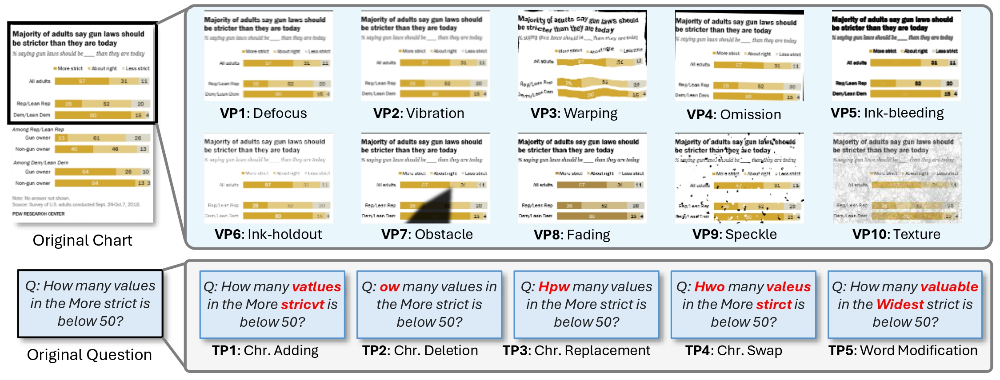

<h1 align="center">🌀 CHAOS: Chart Analysis with Outlier Samples</h1>

<p align="center">
  <a href="https://arxiv.org/abs/your-paper-link" target="_blank">
    
  </a>
  <a href="https://huggingface.co/datasets/omoured/CHAOS" target="_blank">
    
  </a>
</p>

<p align="center">
  
</p>

## ℹ️ About
What happens when the input is *messy*—blurred labels, typos, occlusions, or color shifts? 🤔 **CHAOS** (***CH***art **A**nalysis with **O**utlier **S**amples) is the *first* benchmark purposely designed to stress‑test MLLMs under realistic noise. We:

* evaluate **10 visual** and **5 textual** perturbations, each at three increasing severity levels (*easy → mid → hard*);
* span **112,500 perturbed charts** (2️⃣ 5️⃣ 0️⃣ 0️⃣ per perturbation × 3 levels × 15 types);
* introduce a **Robustness Score** that unifies vision‑ and text‑side degradations for apples‑to‑apples model comparison.

Our goal is simple: **measure how and understand why gracefully MLLMs fail—and, ideally, still succeed—when reality gets noisy.**

## 🚀 Getting Started

Clone the repo **with submodules**:
```bash
git clone --recurse-submodules https://github.com/moured/CHAOS
cd CHAOS
```

Create the environment (Python 3.10 recommended):
```bash
conda create -n chaos python=3.10
conda activate chaos
```

Install dependencies (you can use a different torch version — in our case we experimented with `torch==2.6.0`):
```bash
cd VLMEvalKit
pip install -e .
pip install accelerate qwen-vl-utils
pip install flash-attn --no-build-isolation
pip install torch==2.6.0 torchvision==0.21.0 torchaudio==2.6.0 --index-url https://download.pytorch.org/whl/cu124
```

Copy custom CHAOS dataset files:
```bash
cp ../custom_files/* ./VLMEvalKit/vlmeval/dataset/
```

## 🧪 Evaluation
Run with a single GPU:
```bash
python run.py --data CHAOS_text --model Qwen2.5-VL-7B-Instruct --verbose

```

Run with multiple GPUs:
```bash
torchrun --nproc-per-node=4 run.py --data CHAOS_text --model Qwen2.5-VL-7B-Instruct --verbose
```

You can experiment with different models — please check the [VLMEvalKit repository](https://github.com/open-compass/VLMEvalKit) for a list of supported models.

## 📊 Robustness Metrics
TBD 

## 📚 Citation
```cite
TBD
```
